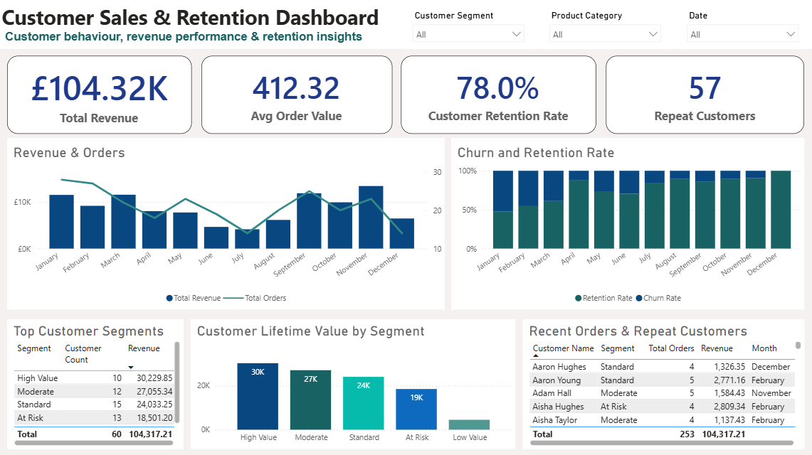
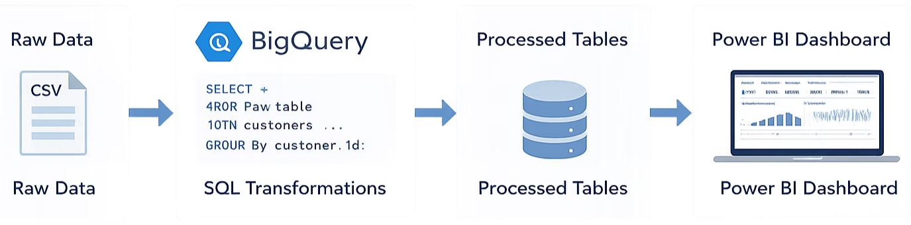

# Customer Sales & Retention Analysis

End-to-end customer analytics project using **SQL**, **Google BigQuery**, and **Power BI** to analyse sales performance, customer behaviour, retention trends, churn, and customer lifetime value.

## Dashboard Preview



## Project Overview

This project explores customer purchasing behaviour and retention performance using a structured analytics workflow. Raw CSV data was loaded into Google BigQuery, transformed using SQL views, and visualised through an interactive Power BI dashboard.

The dashboard helps answer key business questions:

- Which customer segments generate the most revenue?
- How does revenue change over time?
- What is the average order value?
- How many customers are repeat customers?
- How do retention and churn trends change by month?
- Which customers and segments should the business prioritise?

## Tools Used

- SQL
- Google BigQuery
- Power BI
- DAX
- Data modelling
- Data visualisation

## Key Features

- Total revenue and average order value KPI tracking
- Customer retention and churn analysis
- Customer lifetime value by segment
- Top customer segment performance
- Recent orders and repeat customer analysis
- Interactive filtering by customer segment, product category, and date

## Data Pipeline



```text
CSV Data → BigQuery Tables → SQL Views → Power BI Dashboard
```

## Dataset

The project uses three source tables:

- `customers.csv` — customer-level information including segment, country, acquisition channel, last active date, and churn flag.
- `orders.csv` — transaction-level data including order date, quantity, value, status, discount, and payment method.
- `products.csv` — product information including product name, category, and unit price.

## SQL Views

The following SQL views prepare the data for Power BI:

- `customer_transactions`
- `customer_metrics`
- `customer_cohorts`
- `customer_retention`

Example SQL:

```sql
SELECT
  customer_id,
  COUNT(order_id) AS total_orders,
  SUM(order_value) AS total_revenue,
  MAX(order_date) AS last_purchase_date
FROM `imperial-welder-491806-c8.customer_analytics.orders`
GROUP BY customer_id;
```

## Dashboard Metrics

- Total Revenue
- Average Order Value
- Customer Retention Rate
- Repeat Customers
- Revenue & Orders Over Time
- Churn and Retention Rate
- Top Customer Segments
- Customer Lifetime Value by Segment
- Recent Orders & Repeat Customers

## Key Insights

- High Value customers generated the largest share of revenue.
- Repeat customers represented a strong portion of the customer base.
- Customer lifetime value varied significantly by customer segment.
- Retention trends improved across later months, while churn reduced in the same period.
- Segment-level analysis highlighted where customer value and retention efforts should be prioritised.

## Repository Structure

```text
customer-sales-retention-analysis/
├── data/
├── dashboard/
├── docs/
├── images/
├── sql/
├── .gitignore
├── LICENSE
└── README.md
```

## How to Use This Project

1. Upload the CSV files in `data/` to BigQuery.
2. Run the SQL scripts in the `sql/` folder.
3. Connect Power BI to the BigQuery views.
4. Recreate or review the dashboard visuals.
5. Use the DAX measures in `docs/dax_measures.md`.

## Author

**Sophia Lumpa**  
Business Intelligence & Operations Analyst
